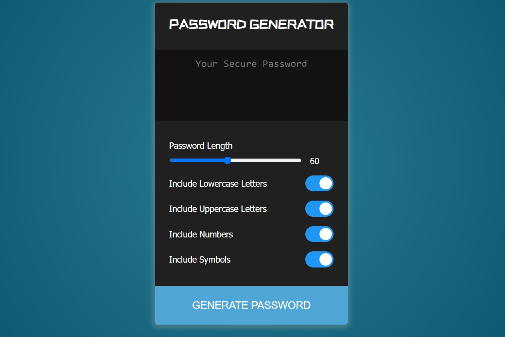

# Password Generator

## Description and Purpose
A password generator application that generates a secure, random password after prompting the user to select from multiple password character criteria. Criteria include password length between 8 and 128 characters, lowercase characters, uppercase characters, numbers, and symbols.

## Table of Contents
  - [Description and Purpose](#description-and-purpose)
  - [Application Screenshot](#application-screenshot)
  - [Deployed Application](#deployed-application)
  - [Built With](#built-with)
  - [License](#license)
  - [Contributing](#contributing)
  - [Questions](#questions)

## Application Screenshot

## Deployed Application
https://mikegshelby.github.io/password-generator/

## Built With
* HTML
* CSS
* Javascript

## License
MIT License

## Contributing
* Mike Shelby

## Questions
Github Username: mikegshelby

Github Profile: https://github.com/mikegshelby

Email: mikegshelby@gmail.com

Please email me with any questions about this project!
